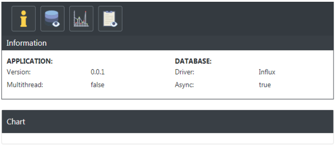
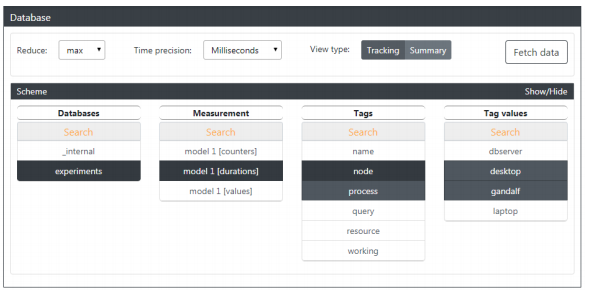

# PViewer

PViewer (Performance Viewer) allows to tracking data in form of time series,
using Influxdb to store them. Ensure also web gui where is possible to draw data as interactive chart using plotly.js.

## Installation

Add this line to your application's Gemfile:

```ruby
gem 'PViewer'
```

And then execute:

    $ bundle

Or install it yourself as:

    $ gem install PViewer

## Usage

Firstly u need ensure working influx database.

##### Initialization

```ruby
PViewer.init(
     {
         driver: 'influx',
         time_precision: 'u',
         database: 'db_name',
         measurement: 'ms_name'
     },
     {
         host: 'localhost',
         port: 2018
 }
)
```

First hash is for database configuration, all options at [influxdb-ruby](https://github.com/influxdata/influxdb-ruby).
Passing second hash allows to set up GUI.

##### Collectors

PViewer allows to collect data details in three defined ways:

* duration,
* amount (counter),
* values.

```ruby
PViewer.durations
PViewer.counters
PViewer.values

collector.write(tags: {}, values: {}, time: Time.now.to_i)
```

##### Data fetching

Mentioned above collectors allows also to read data with the possibility of setting filters and reductions of complex data.

```ruby
    counter = PViewer.counters(measurement: 'cities')
    counter.read(tags: { city: 'New York' }, reduce: :sum)
```

##### GUI

GUI is disabled by default, to run it:

```ruby
    PViewer.run_gui
```




## Development

After checking out the repo, run `bin/setup` to install dependencies. Then, run `rake spec` to run the tests. You can also run `bin/console` for an interactive prompt that will allow you to experiment.

To install this gem onto your local machine, run `bundle exec rake install`. To release a new version, update the version number in `version.rb`, and then run `bundle exec rake release`, which will create a git tag for the version, push git commits and tags, and push the `.gem` file to [rubygems.org](https://rubygems.org).

## Contributing

Bug reports and pull requests are welcome on GitHub at https://github.com/RowinskiAdam/PViewer.

## License

The gem is available as open source under the terms of the [MIT License](https://opensource.org/licenses/MIT).
